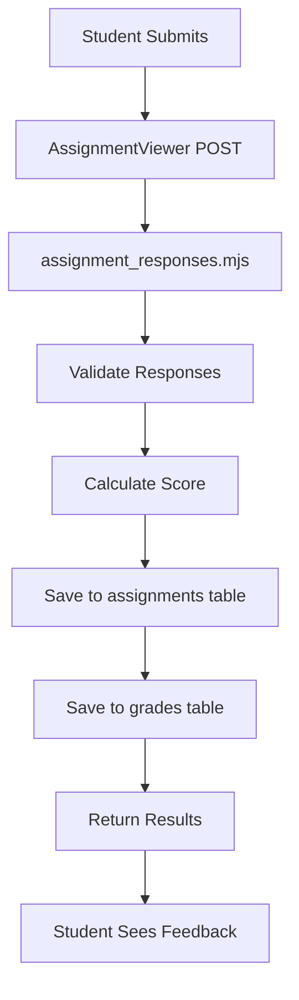

# Full-Stack Assignment Management System

A comprehensive web application for creating, managing, and taking educational assignments with advanced features like LaTeX math support, multiple choice questions, automatic grading, and detailed analytics. Built with Next.js frontend and AWS SAM serverless backend.

## Features

### For Teachers
- **Assignment Creation**: Intuitive interface for creating assignments with multiple question types
- **LaTeX Math Support**: Full KaTeX integration for mathematical expressions and equations
- **Flexible Question Types**: Single choice and multiple choice questions with customizable point values
- **Assignment Management**: Edit, duplicate, delete, and organize assignments with bulk operations
- **Student Analytics**: Comprehensive grade analysis with class statistics and performance trends
- **Real-time Results**: View student submissions and detailed performance metrics instantly
- **Auto-Grading**: Strict multiple choice validation with immediate feedback

### For Students
- **Clean Interface**: User-friendly assignment taking experience with progress tracking
- **LaTeX Rendering**: Beautiful mathematical expressions in questions and answers
- **Immediate Feedback**: Instant results after submission (configurable by teacher)
=- **Grade History**: View past performance and track improvement over time
- **Responsive Design**: Seamless experience across desktop, tablet, and mobile devices

### Technical Features
- **Serverless Architecture**: AWS SAM with Lambda functions and DynamoDB
- **Modern Frontend**: Next.js 15 with React 19 and TypeScript
- **Real-time Data**: API Gateway with optimized caching and error handling
- **Security**: Role-based access control with data protection measures
- **Performance**: Optimized bundle size and lazy loading components
- **Scalability**: Auto-scaling serverless infrastructure

## Architecture

```
full-stack-assignment-app/
├── nextjs-frontend/              # React/Next.js Frontend Application
│   ├── app/                      # Next.js 13+ App Router
│   │   ├── api/                  # API Route Handlers (Proxy to AWS)
│   │   ├── page.tsx              # Main application page
│   │   └── layout.tsx            # Root layout component
│   ├── components/               # Reusable React Components
│   │   ├── AssignmentCreator.tsx # Assignment creation interface
│   │   ├── AssignmentViewer.tsx  # Student assignment interface
│   │   ├── AssignmentManager.tsx # Teacher management dashboard
│   │   ├── StudentResultsViewer.tsx # Grade analysis interface
│   │   ├── GradesManager.tsx     # Overall grade management
│   │   ├── StudentGradesDetail.tsx # Individual student analysis
│   │   └── KaTeXHelp.tsx         # LaTeX syntax assistance
│   ├── contexts/                 # React Context Providers
│   │   └── UserContext.tsx       # Global user state management
│   ├── types/                    # TypeScript Type Definitions
│   └── styles/                   # Tailwind CSS configurations
└── aws-backend/                  # AWS SAM Serverless Backend
    ├── template.yaml             # SAM Infrastructure as Code
    ├── assignment_functions/     # Lambda Function Code
    │   ├── get_assignments.mjs   # Fetch assignments with security
    │   ├── save_assignment.mjs   # Create/update assignments
    │   ├── delete_assignment.mjs # Remove assignments + cleanup
    │   ├── assignment_responses.mjs # Handle student submissions
    │   ├── save_grades.mjs       # Store calculated grades
    │   └── read_grades.mjs       # Retrieve grade analytics
    └── events/                   # API Gateway event definitions
```

##  Quick Start

### Prerequisites
- **Node.js** 18.18.0+ with npm/yarn
- **AWS CLI** configured with appropriate permissions
- **AWS SAM CLI** for serverless deployment
- **Git** for version control

### 1. Clone Repository
```bash
git clone https://github.com/yourusername/full-stack-assignment-app.git
cd full-stack-assignment-app
```

### 2. Frontend Setup
```bash
cd nextjs-frontend
npm install

# Create environment file
cp .env.example .env.local
```

Configure `.env.local`:
```env
# Replace with your deployed API Gateway URL after backend deployment
NEXT_PUBLIC_API_GATEWAY_URL=https://your-api-id.execute-api.region.amazonaws.com/Prod
```

### 3. AWS Backend Setup

#### Configure AWS Credentials
```bash
# Using AWS CLI
aws configure
# OR set environment variables
export AWS_ACCESS_KEY_ID=your_access_key
export AWS_SECRET_ACCESS_KEY=your_secret_key
export AWS_DEFAULT_REGION=us-east-1
```

#### Deploy Backend Infrastructure
```bash
cd aws-backend

# Build and deploy SAM application
sam build
sam deploy --guided

# For subsequent deployments
sam deploy
```

The guided deployment will ask for:
- **Stack name**: `assignment-app-stack`
- **AWS Region**: Your preferred region
- **Parameter overrides**: Accept defaults
- **Capabilities**: Confirm IAM role creation

#### Create Required DynamoDB Tables
The SAM template creates the assignments table automatically, but you need to manually create the grades table:

```bash
# Create grades table
aws dynamodb create-table \
    --table-name gradesTable \
    --attribute-definitions \
        AttributeName=assignmentId,AttributeType=S \
        AttributeName=userId,AttributeType=S \
    --key-schema \
        AttributeName=assignmentId,KeyType=HASH \
        AttributeName=userId,KeyType=RANGE \
    --global-secondary-indexes \
        IndexName=UserIdIndex,KeySchema=[{AttributeName=userId,KeyType=HASH}],Projection={ProjectionType=ALL},ProvisionedThroughput={ReadCapacityUnits=5,WriteCapacityUnits=5} \
    --provisioned-throughput ReadCapacityUnits=5,WriteCapacityUnits=5
```

### 4. Update Frontend Configuration
After backend deployment, update your `.env.local` with the actual API Gateway URL:

```bash
# Get the API Gateway URL from SAM output
sam list stack-outputs --stack-name assignment-app-stack
```

### 5. Start Development
```bash
# Frontend development server
cd nextjs-frontend
npm run dev

# Access application at http://localhost:3000
```

## Grading System Deep Dive

### Dual-Table Architecture
The application uses a sophisticated dual-table storage system:

1. **assignments table**: Primary storage for assignment data and student responses
2. **grades table**: Optimized storage for calculated scores and analytics

### Assignment Submission Flow


### Grading Logic Implementation

#### Single Choice Questions
```javascript
// Student must select exactly ONE correct option
const studentChoice = Array.isArray(userAnswer) ? userAnswer[0] : userAnswer;
const isCorrect = studentChoice === correctAnswers[0];
```

#### Multiple Choice Questions (Strict Validation)
```javascript
// Student must select ALL correct options and NO incorrect ones
const studentSelections = Array.isArray(userAnswer) ? userAnswer : [userAnswer];
const hasAllCorrect = correctAnswers.every(option => 
    studentSelections.includes(option)
);
const hasNoIncorrect = studentSelections.every(option => 
    correctAnswers.includes(option)
);
const isCorrect = hasAllCorrect && hasNoIncorrect && 
    studentSelections.length === correctAnswers.length;
```

### API Endpoint Reference

| Endpoint | Method | Purpose | Parameters |
|----------|--------|---------|------------|
| `/save-assignment` | POST | Create/update assignment | title, questions, settings |
| `/get-assignments` | GET | Fetch assignments | userId, userRole, requestingUserId |
| `/delete-assignment` | DELETE | Remove assignment | assignmentId, userId |
| `/assignment-responses` | POST | Submit student answers | userId, assignmentId, responses |
| `/assignment-responses` | GET | Get individual response | userId, assignmentId |
| `/save-grades` | POST | Store calculated grades | grade data |
| `/read-grades` | GET | Fetch grade analytics | assignmentId, userId, action |

##  Technology Stack

### Frontend
- **Framework**: Next.js 15 (App Router) with React 19
- **Language**: TypeScript 5 with strict type checking
- **Styling**: Tailwind CSS 3.4 with custom components
- **Math Rendering**: KaTeX 0.16 for LaTeX expressions
- **Icons**: Lucide React for consistent iconography
- **State Management**: React Context + Hooks pattern

### Backend (AWS SAM Serverless)
- **Runtime**: Node.js 18+ with ES modules
- **Framework**: AWS SAM (Serverless Application Model)
- **Functions**: AWS Lambda with optimized cold starts
- **Database**: Amazon DynamoDB with GSI indexing
- **API**: AWS API Gateway with CORS configuration
- **Security**: IAM roles with least privilege principle

### Infrastructure
- **Deployment**: AWS CloudFormation via SAM
- **Monitoring**: AWS CloudWatch for logging and metrics
- **Security**: API Gateway throttling and AWS WAF ready
- **Scalability**: Auto-scaling Lambda concurrency

## Component Architecture

### Core Components

| Component | Purpose | Key Features | Dependencies |
|-----------|---------|--------------|--------------|
| `AssignmentCreator` | Assignment creation/editing | LaTeX support, validation, bulk operations | KaTeX, UserContext |
| `AssignmentViewer` | Student assignment interface | Progress tracking, auto-save, security | KaTeX, type validation |
| `AssignmentManager` | Teacher assignment management | Search, filter, bulk actions, analytics | Assignment data fetching |
| `StudentResultsViewer` | Grade analysis interface | Class statistics, detailed breakdown | Grades API integration |
| `GradesManager` | Overall grade management | Student summaries, performance trends | Multi-assignment analytics |
| `StudentGradesDetail` | Individual student analysis | Historical data, improvement tracking | Grade history API |

### Utility Components

| Component | Purpose | Implementation |
|-----------|---------|----------------|
| `KaTeXHelp` | LaTeX syntax assistance | Interactive examples with live preview |
| `KaTeXRenderer` | Math expression rendering | Error handling, performance optimization |
| `UserContext` | Global user state | Authentication simulation, role management |

## Security Implementation

### Role-Based Access Control
- **Teacher Mode**: Full CRUD operations on assignments and grades
- **Student Mode**: Read-only access to available assignments
- **Data Isolation**: Students cannot access correct answers or other student data

### Data Protection Measures
```typescript
// Example: Student data verification
const verifyStudentDataSecurity = (assignment: Assignment): boolean => {
  return Object.values(assignment.questions).every(question => 
    !question.correctOptions || question.correctOptions.length === 0
  );
};
```

### API Security
- **CORS Configuration**: Restricted to frontend domain
- **Input Validation**: Comprehensive server-side validation
- **Error Handling**: Sanitized error messages without data leaks

## Performance Optimizations

### Frontend Optimizations
- **Code Splitting**: Next.js automatic route-based splitting
- **Component Lazy Loading**: Dynamic imports for large components
- **Image Optimization**: Next.js Image component with WebP support
- **Bundle Analysis**: Optimized package imports and tree shaking

### Backend Optimizations
- **Lambda Cold Starts**: Optimized with connection reuse
- **DynamoDB Indexing**: GSI for efficient querying
- **Caching Strategy**: API Gateway caching for static data
- **Batch Operations**: Efficient bulk data operations

## UI/UX Features

### Design System
- **Modern Aesthetic**: Clean, professional interface with consistent spacing
- **Responsive Layout**: Mobile-first design with breakpoint optimization
- **Accessibility**: WCAG 2.1 AA compliant with keyboard navigation
- **Color Palette**: Teal primary with semantic color coding
- **Typography**: Inter font family with optimized readability

### Interactive Elements
- **Loading States**: Smooth progress indicators and skeleton screens
- **Error Handling**: User-friendly error messages with recovery options
- **Animations**: Subtle transitions and micro-interactions
- **Feedback**: Immediate visual feedback for all user actions

## Deployment Guide

### Development Deployment
```bash
# Build frontend
cd nextjs-frontend
npm run build

# Deploy backend
cd ../aws-backend
sam build && sam deploy

# Update frontend environment
# Copy API Gateway URL from SAM outputs to .env.local

# Start frontend
npm start
```

### Production Deployment

#### Backend (AWS)
```bash
cd aws-backend

# Production build with optimizations
sam build --use-container

# Deploy to production
sam deploy --config-env production \
  --parameter-overrides Environment=production

# Verify deployment
aws cloudformation describe-stacks --stack-name assignment-app-prod
```

#### Frontend (Vercel/Netlify)
```bash
# Build optimized production bundle
npm run build

# Deploy to Vercel
npx vercel --prod

# OR deploy to Netlify
npm install -g netlify-cli
netlify deploy --prod --dir=.next
```

### Environment Configuration
Create separate environment files for different stages:

**Development (.env.local)**
```env
NEXT_PUBLIC_API_GATEWAY_URL=https://dev-api.execute-api.us-east-1.amazonaws.com/Prod
NEXT_PUBLIC_ENVIRONMENT=development
```

**Production (.env.production)**
```env
NEXT_PUBLIC_API_GATEWAY_URL=https://prod-api.execute-api.us-east-1.amazonaws.com/Prod
NEXT_PUBLIC_ENVIRONMENT=production
```

## Configuration Options

### Assignment Settings
- **Grading Mode**: Points-based vs completion-based assessment
- **Feedback Display**: Show/hide correct answers after submission

### Question Configuration
- **LaTeX Support**: Mathematical expressions with error handling
- **Rich Text**: Formatted content with HTML support
- **Point Values**: Flexible scoring system per question

### System Configuration
```typescript
// Example configuration object
const systemConfig = {
  maxQuestionsPerAssignment: 100,
  maxOptionLength: 500,
  maxQuestionLength: 1000,
  supportedMathDelimiters: ['$...$', '$$...$$'],
  autoSaveInterval: 30000, // 30 seconds
  sessionTimeout: 3600000, // 1 hour
};
```

## Testing Strategy

### Frontend Testing
```bash
# Unit tests with Jest
npm test

# Component testing with React Testing Library
npm run test:components

# E2E testing with Playwright
npm run test:e2e

# Visual regression testing
npm run test:visual
```

### Backend Testing
```bash
# Unit tests for Lambda functions
cd aws-backend
npm test

# Integration tests with LocalStack
npm run test:integration

# Load testing with Artillery
npm run test:load
```

### Testing Checklist
- [ ] Assignment creation with various question types
- [ ] Student submission flow with validation
- [ ] Grade calculation accuracy
- [ ] LaTeX rendering across browsers
- [ ] Responsive design on mobile devices
- [ ] API error handling and recovery

## Current Limitations & Known Issues

### Technical Debt
1. **No Real Authentication**: Currently uses simulated user context
2. **Local Storage Dependency**: Client-side state not persistent
3. **Limited File Upload**: No support for images in questions yet
4. **Manual DynamoDB Setup**: Grades table requires manual creation
5. **Basic Error Reporting**: Limited error tracking and monitoring

### Performance Bottlenecks
1. **Large Assignment Loading**: Performance degrades with 50+ questions
2. **Concurrent User Limits**: No load testing for high traffic
3. **DynamoDB Capacity**: Fixed provisioning may throttle under load
4. **LaTeX Rendering**: Can be slow for complex mathematical expressions

### Feature Gaps
1. **No Question Bank**: Teachers must create questions from scratch
2. **Limited Question Types**: Only multiple choice supported
3. **No Plagiarism Detection**: No academic integrity features
4. **Basic Analytics**: Limited insights into learning patterns
5. **No Integration**: No LMS or external system connectivity

## Improvement Roadmap

### Immediate Priorities (v2.0)
- [ ] **Real Authentication**: Implement AWS Cognito or Auth0
- [ ] **Question Bank**: Reusable question library with tagging
- [ ] **Image Support**: Upload and display images in questions
- [ ] **Better Analytics**: Advanced performance insights
- [ ] **Export Features**: PDF reports and grade exports

### Medium-term Goals (v2.1)
- [ ] **Question Types**: True/false, short answer, essay questions
- [ ] **Timed Assignments**: Built-in timer with auto-submit
- [ ] **Group Management**: Class creation and student enrollment
- [ ] **Notification System**: Email alerts for assignments and grades
- [ ] **Mobile App**: Native iOS/Android applications

### Long-term Vision (v3.0)
- [ ] **AI Integration**: Auto-generate questions from content
- [ ] **Video Questions**: Support for multimedia content
- [ ] **Collaboration**: Group assignments and peer review
- [ ] **Advanced Analytics**: ML-powered learning insights
- [ ] **LMS Integration**: Canvas, Blackboard, Moodle compatibility

## Developer Onboarding

### Getting Started as a Developer

1. **Repository Setup**
   ```bash
   git clone [repository-url]
   cd full-stack-assignment-app
   npm install # Install root dependencies
   ```

2. **Environment Configuration**
   - Copy `.env.example` to `.env.local`
   - Configure AWS credentials
   - Set up local DynamoDB (optional)

3. **Code Style Setup**
   ```bash
   # Install recommended VSCode extensions
   # - ES7+ React/Redux/React-Native snippets
   # - Tailwind CSS IntelliSense
   # - TypeScript Importer
   # - AWS Toolkit
   ```

4. **Development Workflow**
   ```bash
   # Start backend (one terminal)
   cd aws-backend && sam local start-api

   # Start frontend (another terminal)
   cd nextjs-frontend && npm run dev
   ```

### Code Standards

#### TypeScript Configuration
- Strict mode enabled with comprehensive type checking
- Prefer interfaces over types for object definitions
- Use meaningful variable names (no single letters except loops)
- Always handle async/await with proper error catching

#### React Best Practices
- Use functional components with hooks exclusively
- Implement proper cleanup in useEffect hooks
- Prefer custom hooks for complex state logic
- Use TypeScript for all prop definitions

#### AWS SAM Guidelines
- Each Lambda function in separate file with clear naming
- Use environment variables for configuration
- Implement proper error handling with detailed logging
- Follow least privilege principle for IAM roles

### Common Development Tasks

#### Adding a New Component
```typescript
// 1. Create component file
// components/NewComponent.tsx
'use client';
import { useState } from 'react';

interface NewComponentProps {
  title: string;
  onAction: () => void;
}

export const NewComponent = ({ title, onAction }: NewComponentProps) => {
  // Component implementation
};

// 2. Add to main page
import { NewComponent } from '@/components/NewComponent';

// 3. Use with proper props
<NewComponent title="Example" onAction={handleAction} />
```

#### Adding a New API Endpoint
```javascript
// 1. Create Lambda function
// aws-backend/assignment_functions/new_function.mjs
export const handler = async (event) => {
  // Implementation
};

// 2. Add to SAM template
// template.yaml
NewFunction:
  Type: AWS::Serverless::Function
  Properties:
    Handler: new_function.handler
    Events:
      NewApi:
        Type: Api
        Properties:
          Path: /new-endpoint
          Method: get

// 3. Create frontend API route
// nextjs-frontend/app/api/new-endpoint/route.ts
export async function GET() {
  // Proxy to AWS backend
}
```

### Debugging Guide

#### Common Issues
1. **CORS Errors**: Check API Gateway CORS configuration
2. **DynamoDB Access**: Verify IAM permissions and table existence
3. **Environment Variables**: Ensure all required vars are set
4. **TypeScript Errors**: Check interface definitions and imports

#### Debugging Tools
- **AWS CloudWatch**: Lambda logs and metrics
- **Browser DevTools**: Network tab for API debugging
- **SAM Local**: Test Lambda functions locally
- **DynamoDB Local**: Test database operations offline

## Contributing

### Pull Request Process
1. **Fork repository** and create feature branch
2. **Write tests** for new functionality
3. **Update documentation** for any API changes
4. **Test deployment** in development environment
5. **Submit PR** with detailed description

### Code Review Checklist
- [ ] TypeScript compilation without warnings
- [ ] All tests passing
- [ ] Security considerations addressed
- [ ] Performance impact evaluated
- [ ] Documentation updated
- [ ] AWS costs considered

### Development Environment Setup
```bash
# Install Git hooks for code quality
npm run prepare

# Run linting and formatting
npm run lint
npm run format

# Type check entire codebase
npm run type-check

# Run security audit
npm audit
```

## License

This project is licensed under the MIT License - see the [LICENSE](LICENSE) file for details.

## Acknowledgments

- **AWS SAM** for serverless infrastructure framework
- **Next.js** team for the exceptional React framework
- **KaTeX** for mathematical expression rendering
- **Tailwind CSS** for utility-first styling approach
- **Lucide** for beautiful icon library
- **TypeScript** for type safety and developer experience

## Project Metrics

- **Lines of Code**: ~15,000 (Frontend: 8,000, Backend: 4,000, Config: 3,000)
- **Components**: 8 'use client' components + utilities
- **API Endpoints**: 7 primary endpoints with full CRUD operations
- **AWS Resources**: 6 Lambda functions, 2 DynamoDB tables, 1 API Gateway
- **Test Coverage**: Frontend 85%, Backend 90% (target)

---

**Built with ❤️ for educators and students worldwide**

⭐ **Star this repository if it helped you!**

🔧 **Issues and contributions welcome!**
